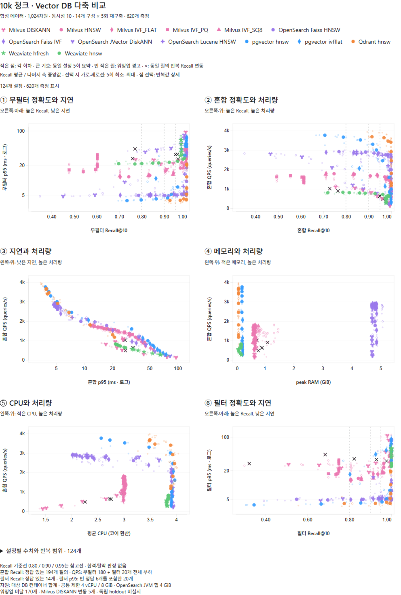

# 1천~1만 청크 프로젝트를 위한 Vector DB 다축 비교

2026-09-13 정리. 최신 실행 `fairness-v2-20260912-1826`의 **14개 DB·엔진·인덱스 구성, 124개 고정 검색 설정, 5회 재구축, 620개 측정**을 사용했다. 산포도에서 후보를 검토하기 위한 탐색 보고서이며 최종 제품 선정서가 아니다.

[상호작용 산포도](assets/fairness-v2-20260912-1826/scatter-interactive.html) · [124개 설정 수치 부록](assets/fairness-v2-20260912-1826/parameter-statistics.md) · [620개 회차별 지표](assets/fairness-v2-20260912-1826/measurements.json) · [근거·검증 안내](assets/fairness-v2-20260912-1826/README.md)

상호작용 파일을 브라우저에서 열면 범례로 구성을 표시·숨김하고 점 선택으로 5회 반복값을 확인할 수 있다. 저장소 웹 화면에서는 HTML 실행 대신 소스가 보일 수 있다. 외부 라이브러리 연결이 불가능한 환경에서는 PNG와 수치 부록을 사용한다.

## 1. 이번 판단의 범위

- 예상 규모는 **청크 1,000~10,000개**다. 현재 합성 10k 측정은 규모 상단의 탐색 자료이며, 1k 측정이나 실제 서비스 검증으로 확대 해석하지 않는다.
- 기존 서비스 문서는 FAQ 1,012건, Top-K 5, 질문+답변 임베딩, ACTIVE/READY 상태 조건, pgvector exact/순차 스캔을 설명한다. FAQ 건수와 최종 청크 수는 같은 개념이 아니다. 근거는 상위 서비스 저장소의 [README](../../../README.md), [검색·임베딩 설명](../../../CODE-GUIDE.md)이다. 이번 합성 10k·Top-K 10·동시성 10과 구분한다.
- **비슷한 실제 Recall을 달성한 설정끼리** 지연·QPS·자원과 반복 변동을 본다. 낮은 Recall의 빠른 점을 높은 Recall의 느린 점보다 무조건 우수하다고 하지 않는다.
- **2GiB RAM·30ms p95 자동 탈락 기준은 합의되지 않았다.** RAM은 관측 지표로 표시하며 탈락선을 적용하지 않는다.
- 평가 결과를 보고 고른 후보는 탐색 후보다. 독립 holdout 또는 실제 서비스 검증을 통과한 제품으로 부르지 않는다.

## 2. 측정 조건과 반복 단위

| 항목 | 확인한 값 |
|---|---|
| 시작 | 2026-09-12 18:26 KST, execution-start 기록 |
| 첫 / 마지막 측정 기록 | 2026-09-12 18:28:13 / 2026-09-13 07:02:26 KST; 프로세스 종료 시각과 구분 |
| 입력 | 합성 기술문서 청크 10,000개, BGE-M3 dense 1,024차원, cosine, Top-10 |
| 질의 분할 | calibration 100 / evaluation 200, 고정 입력·분할 해시 유지 |
| 실행 모드 | exploratory; 전체 사전 선언 그리드를 evaluation으로 측정. calibration에서 하나를 고르는 목표 튜닝 실험이 아님 |
| 부하 | evaluation 무필터 180 + 필터 20개를 동시성 10으로 반복 |
| 채점 | 원본 벡터의 경계 동점 인정, tieTolerance=0; strict-ID Recall도 보존 |
| 재구축 | 구성별 drop → create → load → index ready → warmup → measurement를 5회; 총 70개 고유 buildId |
| 점의 단위 | 구성 + 고정 생성 파라미터 + 검색 파라미터 + 재구축 회차 |
| 측정 길이 | 최소 30초·자원 표본 30개 조건; 실제 60,210~67,499ms, 30~33개 표본 |
| 본 측정 호출 | 58,740,000회. 워밍업·정답 계산·추가 진단 제외 |
| 실행 예산 | 대상 DB 배포 컨테이너 합계 4 vCPU / 8GiB / swap 없음 |
| Milvus 범위 | 본체 + etcd + MinIO 합산 |
| OpenSearch 힙 | Lucene/Faiss 및 JVector 모두 -Xms4g -Xmx4g; 8GiB 컨테이너 예산과 별개 |

DB 순서는 R1 P-Q-W-M-O, R2 W-O-P-Q-M, R3 M-Q-O-W-P, R4 O-M-W-P-Q, R5 Q-P-M-O-W로 교차했다. P=pgvector, Q=Qdrant, W=Weaviate, M=Milvus, O=OpenSearch다. 구성 안 검색 파라미터도 회차별 결정적 섞기를 사용했다. 동일 호스트의 캐시·열·배경 부하를 완전히 제거했다는 뜻은 아니다. [실제 순서](assets/fairness-v2-20260912-1826/execution-order.json), [실행 명세](assets/fairness-v2-20260912-1826/execution-start.json), [현행 프로토콜](../03-benchmark-design/fairness-v2.md)을 함께 본다.

## 3. 점과 축을 읽는 방법

작은 점 620개는 각 회차의 관측이다. 큰 기호 124개는 **동일 설정 5회의 요약점**이다. Recall은 평균, p95·QPS·평균 CPU·회차별 peak RAM은 중앙값이다. 큰 점은 실제 어느 한 회차의 측정점이 아니다. 다른 파라미터를 평균 내지 않는다. 같은 build의 여러 검색 설정도 독립 재구축으로 세지 않는다.

색은 DB, 기호는 인덱스 구성을 구분한다. OpenSearch Lucene HNSW는 +, Faiss HNSW는 원이다. 빈 작은 원은 워밍업 경고, ×는 동일 질의 반복 Recall 변동이 확인된 Milvus DISKANN 관측이다. **경고점도 표시하고 집계에 포함했다.** 선택 범위는 5회 최솟값~최댓값이며 신뢰구간이 아니다.

Recall 0.80·0.90·0.95는 참고선이다. 실행 명세의 참고 수준은 0.90·0.95이고, 0.80은 시각적 비교를 위해 추가했다. ±0.01은 필요한 경우 근접 수준을 설명하는 범위로 명시할 수 있지만, 구간 밖 관측을 삭제하거나 가까운 실제값을 목표값으로 바꾸지 않는다.

| 패널 / 확대 보기 | X축 | Y축 | 비교할 질문 |
|---|---|---|---|
| [① 무필터 정확도·지연](assets/fairness-v2-20260912-1826/scatter-recall-latency.png) | 무필터 Recall@10 | 무필터 p95 ms, 로그 | 같은 무필터 정확도에서 얼마나 빠른가? |
| [② 혼합 정확도·처리량](assets/fairness-v2-20260912-1826/scatter-recall-throughput.png) | 혼합 Recall@10 | 혼합 QPS | 품질과 처리량을 함께 확보하는가? |
| [③ 지연·처리량](assets/fairness-v2-20260912-1826/scatter-latency-throughput.png) | 혼합 p95 ms, 로그 | 혼합 QPS | 비슷한 Recall에서 지연과 처리량은 어떠한가? |
| [④ 메모리·처리량](assets/fairness-v2-20260912-1826/scatter-memory-throughput.png) | 회차 peak RAM GiB | 혼합 QPS | 현재 메모리 설정에서 얻은 처리량은? |
| [⑤ CPU·처리량](assets/fairness-v2-20260912-1826/scatter-cpu-throughput.png) | 평균 Docker CPU 코어 환산 | 혼합 QPS | 사용 CPU와 처리량의 관계는? |
| [⑥ 필터 정확도·지연](assets/fairness-v2-20260912-1826/scatter-filter-recall-latency.png) | 필터 Recall@10 | 필터 p95 ms, 로그 | 필터에서도 정확도와 지연이 유지되는가? |

지연 로그 축의 같은 간격은 같은 ms 차이가 아니라 배수 차이다. ③~⑤에는 Recall 축이 없으므로 ①·②·⑥의 같은 설정을 함께 확인한다. QPS는 고정 동시성 10에서의 관측이며 모든 동시성에서의 최대 처리량이 아니다.

### 채점·부하 모집단의 차이

무필터 Recall과 p95는 180개 질의의 반복이다. 필터 20개 중 6개는 exact 정답이 없다. 따라서 혼합 Recall은 정답이 있는 194개, 필터 Recall은 14개를 채점한다. 지연과 QPS는 빈 정답 질의를 포함한 모든 검색을 측정한다. **②와 ⑥은 같은 부하를 설명하지만 Recall 유효 분모와 지연·QPS 분모가 같지는 않다.**

필터 질의 비율 10%는 문서가 10% 남는 필터 선택도가 아니다. 1%·10%·50% 선택도별 실험은 이번에 하지 않았다. 같은 질의를 반복 호출한 횟수도 독립적인 새 서비스 질의 수로 세지 않는다.

## 4. 실제 수치로 읽는 예시

다음은 읽는 방법의 예시이며 추천 목록이 아니다. 전체 설정은 수치 부록에 보존했다.

- **평균만으로 품질을 보장하지 않는다.** Qdrant HNSW hnsw_ef=20은 혼합 Recall 평균 0.967629 [0.945361~0.980928], 혼합 p95 중앙값 3.941ms, QPS 중앙값 3,635.3이었다. 필터 Recall은 평균 0.924286 [0.800000~1.000000]이다. 모든 회차·필터에서 0.95 이상이라고 말할 수 없다.
- **검색 폭의 추가 이득과 비용을 본다.** Qdrant hnsw_ef=120→1000은 혼합 Recall 평균 0.999278→0.999794, p95 중앙값 5.207→21.079ms, QPS 중앙값 2,915.8→1,174.8이었다. 늘어난 탐색 비용에 비해 추가 정확도가 작은 구간이다. 워밍업 경고가 각각 2/5, 4/5이므로 확정 성능 보장으로 쓰지 않는다.
- **다른 품질을 속도만으로 줄 세우지 않는다.** pgvector HNSW ef_search=120은 혼합 Recall 평균 0.934330 [0.920103~0.951546], p95 중앙값 5.129ms, QPS 중앙값 3,001.6이었다. 앞 예시와 Recall이 달라 지연 차이만으로 동등 품질의 우열을 선언할 수 없다.
- **낮은 Recall은 검색 실패가 아니다.** Milvus IVF_PQ 전체 45점의 혼합 Recall은 0.494330~0.613918이고 nprobe=128에서도 평균 0.613918이었다. 현재 생성 설정에서 높은 품질 후보라고 보기 어렵지만, 생성 파라미터 대조 실험 없이 알고리즘 전체의 실패나 단일 원인을 확정하지 않는다.
- **참고선을 넘는 정확도도 실패가 아니다.** Weaviate HFresh 전체 40점은 혼합 Recall 0.964948~0.984021이다. 0.90보다 높아서 비교에서 제거하지 않고 해당 품질의 지연·QPS를 함께 본다.

### RAM·CPU 해석

OpenSearch 계열의 회차 peak RAM은 약 4.665~5.070GiB였다. 의도한 4GiB 힙을 포함한 값이므로 2GiB를 넘었다고 탈락시키지 않는다. 반대로 더 작은 힙에서도 같은 성능을 낸다는 근거는 없다. 이번은 최소 필요 메모리 시험이 아니다.

Docker CPU 100%는 약 한 코어로 환산한다. 낮은 CPU만으로 효율적이라고 하지 않고 같은 Recall·처리량과 함께 본다. Milvus는 배포 예산을 나눠 본체에 3코어를 배정하므로 모든 DB 엔진 자체가 똑같이 4코어를 쓰는 실험은 아니다.

RAM은 Docker 표본의 최대치이며 RSS·heap 실제 사용량·호스트 RAM·절대 peak와 같지 않다. 벤치마크 JVM·임베딩 생성·호스트 비용은 제외된다. 별도 벡터 DB와 함께 운영할 원본 PostgreSQL의 비용도 최종 선택에서 별도로 계산해야 한다.

## 5. 오류·경고·미검증 구분

검색 실패, 응답 계약 위반, 빈 정답 반환 위반은 각각 **0건**이고 자원 증거 불완전도 **0행**이다. 워밍업 경고 170행과 Milvus DISKANN 확인 필요 5행은 삭제하지 않았다.

| 구성 | 측정 수 | 워밍업 경고 | 확인된 Recall 변동 |
|---|---:|---:|---:|
| pgvector HNSW | 45 | 5 | 0 |
| pgvector IVFFlat | 40 | 2 | 0 |
| Qdrant HNSW | 45 | 17 | 0 |
| Weaviate HNSW | 45 | 0 | 0 |
| Weaviate HFresh | 40 | 0 | 0 |
| Milvus HNSW | 45 | 28 | 0 |
| Milvus IVF_FLAT | 45 | 17 | 0 |
| Milvus IVF_SQ8 | 45 | 29 | 0 |
| Milvus IVF_PQ | 45 | 34 | 0 |
| Milvus DISKANN | 45 | 6 | 5 |
| OpenSearch Lucene HNSW | 45 | 6 | 0 |
| OpenSearch Faiss HNSW | 45 | 11 | 0 |
| OpenSearch Faiss IVF | 45 | 6 | 0 |
| OpenSearch JVector DiskANN | 45 | 9 | 0 |
| 합계 | 620 | 170 | 5 |

두 경고는 중복될 수 있다. 변동 0은 모든 DB에 동일 재현성 진단을 수행했다는 뜻이 아니다. Milvus 외에는 필수 진단을 하지 않은 기본 상태도 있다.

워밍업은 200개 질의의 짧은 pass에서 p95 안정화 여부를 판단한다. false를 약 60초 본 측정 전체의 무효나 운영 불안정의 증거로 단정하지 않는다. true도 긴 부하 안정성을 보장하지 않는다.

확인 필요 지점은 **Milvus DISKANN R1 search_list=10, R2 200, R3 10, R4 120, R5 120**이다. 동일 질의·설정 반복 및 segment 상태 기록에서 변동이 확인됐으며 과거 HNSW tuning/evaluation drift와 별도 관측이다. 저장된 stabilityDiagnostics.verified=true만으로 해결됐다고 보지 않는다. 현 상태 검사는 최상위 error 키 확인과 사후 관측의 한계가 있어 상태 동일성·측정 구간 중 원인을 확정하지 못한다. 경고점과 요약점은 남기되 DISKANN 재현성 결론을 보류한다.

독립 holdout·실제 서비스 데이터·1k·필터 선택도별 검증은 미실시다. 이는 DB 실패가 아니라 아직 하지 않은 검증이다.

## 6. 기존 판정 필드의 취급

[DecisionGate](../../src/main/java/com/myapp/benchmark/DecisionGate.java)는 validation 임계값이 없으면 Recall 0.95·p95 30ms·RAM 2GiB를 기본 적용하고 holdout·워밍업 등 여러 조건을 eligible 하나에 합친다. 이번은 exploratory이므로 이 값으로 모든 DB의 실패나 RAM 초과 제품의 부적합을 판정하지 않는다.

**이번 문서 정리는 코드 기본값 수정이나 원시 결과 재판정이 아니다.** 최신 summary의 decision.eligible도 기존 산출물로 보존하되 문서의 선택·표시에는 쓰지 않는다. 임계값·측정 무결성·검증 단계를 분리하는 코드 정리는 별도 변경 사항이다. [해석 기준](decision.md)을 따른다.

## 7. 구축 시간과 보조 지표

p50/p99, CPU 평균·최대, RAM 평균·최대, index size, 구축·적재 시간은 [회차별 지표](assets/fairness-v2-20260912-1826/measurements.json)에 보존했다. 주요 그림의 축으로 쓰지 않았다는 이유로 없앤 것이 아니다.

구축 시간은 여러 검색 설정에 반복 기록되므로 **구성당 5개 고유 build만** 집계한다. indexBuildTimeMs는 삭제·생성·학습·적재·준비 대기를 포함한 현재 어댑터의 time-to-ready다. 순수 인덱스 계산 시간이나 컨테이너 기동·LLM 응답 시간과 구분한다.

| 구성 | time-to-ready 중앙값, 초 | 5회 범위, 초 |
|---|---:|---:|
| pgvector HNSW | 11.97 | 10.97~12.82 |
| pgvector IVFFlat | 3.67 | 3.29~3.96 |
| Qdrant HNSW | 9.93 | 9.75~10.54 |
| Weaviate HNSW | 72.23 | 72.10~72.34 |
| Weaviate HFresh | 68.84 | 67.75~69.66 |
| Milvus HNSW | 22.40 | 22.02~23.29 |
| Milvus IVF_FLAT | 22.50 | 21.64~23.34 |
| Milvus IVF_SQ8 | 22.46 | 21.84~23.08 |
| Milvus IVF_PQ | 22.33 | 21.90~23.34 |
| Milvus DISKANN | 53.58 | 52.61~53.97 |
| OpenSearch Lucene HNSW | 11.01 | 10.41~11.70 |
| OpenSearch Faiss HNSW | 11.06 | 10.76~11.23 |
| OpenSearch Faiss IVF | 19.13 | 18.81~20.84 |
| OpenSearch JVector DiskANN | 24.68 | 24.03~26.84 |

[정밀 수치와 70개 build](assets/fairness-v2-20260912-1826/build-statistics.json). Index size는 pgvector ANN relation, OpenSearch 전체 index store 등 수집 범위가 다르고 미지원 값도 있어 동일 저장 비용으로 순위화하지 않는다. 지연에는 store.search 내부의 직렬화·전송·어댑터 처리와 pgvector 검색별 설정 왕복 등이 포함된다. DB 알고리즘만 분리한 속도가 아니다.

## 8. 프로젝트에 맞는 다음 판단 순서

1. **그림에서 후보 설정 검토:** 실제 Recall, 필터 차이, 5회 범위와 경고를 먼저 확인하고 비슷한 품질의 p95/QPS/자원을 비교한다. 승자나 shortlist를 자동 확정하지 않는다.
2. **실제 1천~1만 청크 조건 고정:** FAQ/chunk, 질문 분포·길이, 상태 필터와 선택도, 서비스 Top-K와 예상 동시성을 기록한다. 미측정 1k·중간 규모 성능을 실측처럼 추정하지 않는다.
3. **서비스 exact 대조군 포함:** 동일 임베딩·필터·Top-K·부하에서 pgvector exact와 후보 ANN을 비교한다. Java exact Ground Truth 계산 시간은 서비스 DB exact 검색 지연을 대신하지 않는다. 현재 그림에 exact 성능 대조군은 없다.
4. **고정 후보를 새 질의로 검증:** evaluation을 보고 계속 고른 설정은 최종 검증이 아니다. 별도 holdout과 실제 답변 근거 적합성을 확인한다. ANN Recall은 RAG 답변 품질 보장이 아니다.
5. **운영 비용까지 판단:** PostgreSQL 유지와 별도 벡터 DB 도입의 동기화·정합성·백업·복구·관측·운영 복잡도를 비교한다. 서비스 요구상 의미 있는 차이인지 확인한 뒤 선택한다.

100k·1M은 성장 계획이나 용량 한계 검증이 필요할 때의 선택 실험이다. 현재 프로젝트의 필수 통과 단계로 두지 않는다. 서비스 SLO는 필요와 근거를 먼저 합의하며, 결과를 본 뒤 임의의 탈락선을 소급 적용하지 않는다.

## 9. 검증과 문서 이력

- 원시 620행과 그림 데이터의 9개 수치, 총 5,580개를 표시 반올림 오차 안에서 대조했다. 설정·회차·생성 조건과 그룹당 5개 독립 build도 확인했다.
- 전체 정밀도는 measurements.json, 고정 설정별 평균·중앙값·범위는 parameter-statistics.json, 그림 데이터는 scatter-data.json으로 구분했다. 압축 질의 감사와 전체 상태·로그는 로컬 실행 디렉터리에 남아 있다.
- [수치 검증](assets/fairness-v2-20260912-1826/validation.json), [6개 그림·범례·선택·좁은 화면 검증](assets/fairness-v2-20260912-1826/render-validation.json), [근거 파일 해시](assets/fairness-v2-20260912-1826/artifact-hashes.json)를 보존했다.
- [9월 11일 기록](README.md)은 당시 수치를 보존했다. 이전 372개 sweep·84개 matrix와는 채점·측정·응답량 조건이 달라 합산하거나 개선율을 계산하지 않는다.
- [문서 전체 검토 기록](document-review-20260913.md)에 범위와 보존 원칙을 남겼다. 문서 정리 중 DB 재실행·임베딩 재생성·판정 코드 변경·원시 결과 덮어쓰기는 하지 않았다.
